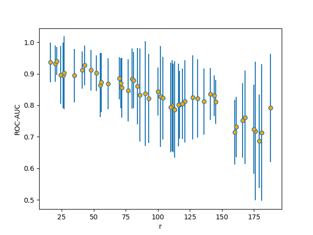

# VIC Validity index 
This repository describes the use and implementatiof internal cluster validation by using ensemble supervised classifiers, as reported in [1]

An example of application is available.

[1] Rodríguez, J., Medina-Pérez, M. A., Gutierrez-Rodríguez, A. E., Monroy, R., & Terashima-Marín, H. (2018). Cluster validation using an ensemble of supervised classifiers. Knowledge-Based Systems, 145, 134–144. https://doi.org/10.1016/j.knosys.2018.01.010.